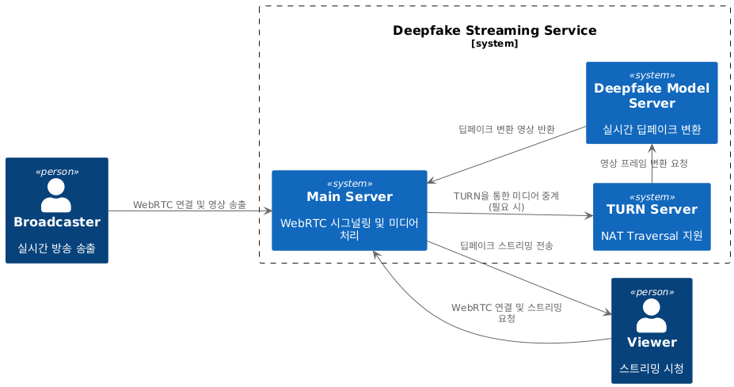
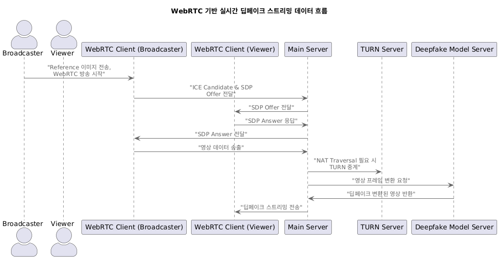
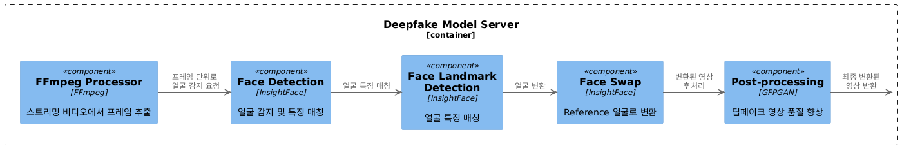

# 🎭 realTimeDeepfake_based_on_WebRTC

### 📌 개요
본 프로젝트는 **WebRTC(Web Real-Time Communication) 기반의 실시간 딥페이크 영상 처리 서비스로, Roop 기술(one-shot face swap)을 활용하여 간편하게 사용자의 얼굴을 실시간으로 변환하여 스트리밍하는 기능을 제공**한다.
기존의 딥페이크 모델처럼 복잡한 학습 과정 없이, **단 하나의 이미지(reference image)만으로 즉각적인 얼굴 변환**이 가능하며, **WebRTC를 활용한 간편한 접근성과 낮은 지연 시간의 실시간 변환**이 가능하도록 설계되었다.

✅ **주요 기능**  
- **Roop**: AI 딥러닝 모델을 활용한 얼굴 변환  
- **WebRTC 스트리밍**: 낮은 지연 시간의 실시간 영상 처리  
- **P2P 및 TURN 서버 지원**: 클라우드와 같은 방화벽/NAT 환경에서도 원활한 연결  
- **웹 및 모바일 지원**: 브라우저에서 실행 가능

---

### 📌 개발 목표
✅ **단일 이미지를 투입해 얼굴을 변환하는 Roop 기능으로, 간편하고 즉각적인 서비스 조작**

✅ **웹 브라우저 및 모바일에서 사용 가능한 서비스 구축**

✅ **WebRTC 기반의 낮은 지연 시간을 갖는 실시간 딥페이크 스트리밍 구현**

✅ **Distributed Data Parallel (DDP) 구현으로 다수의 GPU를 활용한 딥러닝 모델 연산 최적화**  

✅ **각 기능별 클라우드 내 서버 분리로 확장성 및 부하 분산 가능**  

---

### 📌 서버 구성 요소
이 서비스는 다음과 같은 3개의 주요 서버로 구성됩니다.

1️⃣ **WebRTC 서버** – 클라이언트 간 P2P 연결 관리 및 신호 전달 (Signaling Server)  
2️⃣ **TURN 서버** – NAT/방화벽 우회 (Relay Server)  
3️⃣ **Roop 서버(프레임 변환 서버)** – 실시간 단일 이미지 얼굴 변환 수행 (딥페이크 모델 실행)  

---

### 📍 흐름도 설명
1. **클라이언트 (Broadcaster, Viewer)** 가 **웹 및 모바일 브라우저**를 통해 **WebRTC 서버 접속**
2. **클라이언트 (Broadcaster)** 가 **WebRTC 서버를 통해 시그널링 (Signaling) 및 스트리밍 서비스 송출 시작**
3. **P2P 연결 실패 시 -> TURN 서버를 거쳐** 데이터 전송
4. **WebRTC에서 캡처한 프레임을 -> 프레임 변환 Deepfake용 Roop서버로 전송**
5. **프레임 변환 서버에서 AI 변환 후 -> WebRTC 서버로 반환**
6. **변환된 프레임을 WebRTC를 통해 -> 클라이언트 B에게 전송**

---
### 📌 주요 흐름

#### ✅ 1. WebRTC 서버
- 클라이언트 간 시그널링 처리 (ICE Candidate 교환)
- 연결 정보를 전달하고 TURN 서버 정보를 제공

#### ✅ 2. TURN 서버 (P2P 연결 실패 시)
- 방화벽/NAT 문제로 P2P 연결이 불가능할 경우 중계 서버 역할

#### ✅ 3. Roop 프레임 변환 서버 (AI 딥페이크 서버)

- 클라이언트에서 WebRTC로 전달된 프레임을 수신
1) 얼굴 감지(Face Detection) : 입력된 비디오나 이미지에서 얼굴을 찾아냄.
2) 얼굴 특징 매칭(Face Landmark Detection) : 얼굴의 주요 포인트(눈, 코, 입 등)를 분석하여 구조를 이해함.
3) 얼굴 변환(Face Swap) : 사용자가 업로드한 단일 이미지(reference image)의 얼굴을 기존 얼굴과 정렬 및 변형하여 적용함.
4) 후처리(Post-processing)
GFPGAN 이미지 복원 및 품질 향상 기술을 함께 사용해 자연스러운 결과를 만듦.

- 변환된 프레임을 다시 클라이언트로 전송

#### ✅ 4. WebRTC 스트리밍
- 변환된 영상이 WebRTC를 통해 상대방 클라이언트로 전달

---

### 📌 기술 스택

#### 🖥 **Backend**
- **WebRTC** (Signaling & P2P Video Streaming)
- **Python / Flask** (API Server)
- **PyTorch / TensorFlow** (딥페이크 AI 모델)
- **Redis / Celery** (비동기 프레임 처리)

#### 📡 **Infra**
- **AWS EC2, GPU 인스턴스** (AI 연산 서버)
- **Docker / Kubernetes** (컨테이너 관리)
- **Nginx / WebSocket** (실시간 연결 지원)

#### 💻 **Frontend**
- **React.js / Next.js** (웹 UI)
- **WebRTC API** (카메라 스트리밍 & P2P 연결)

